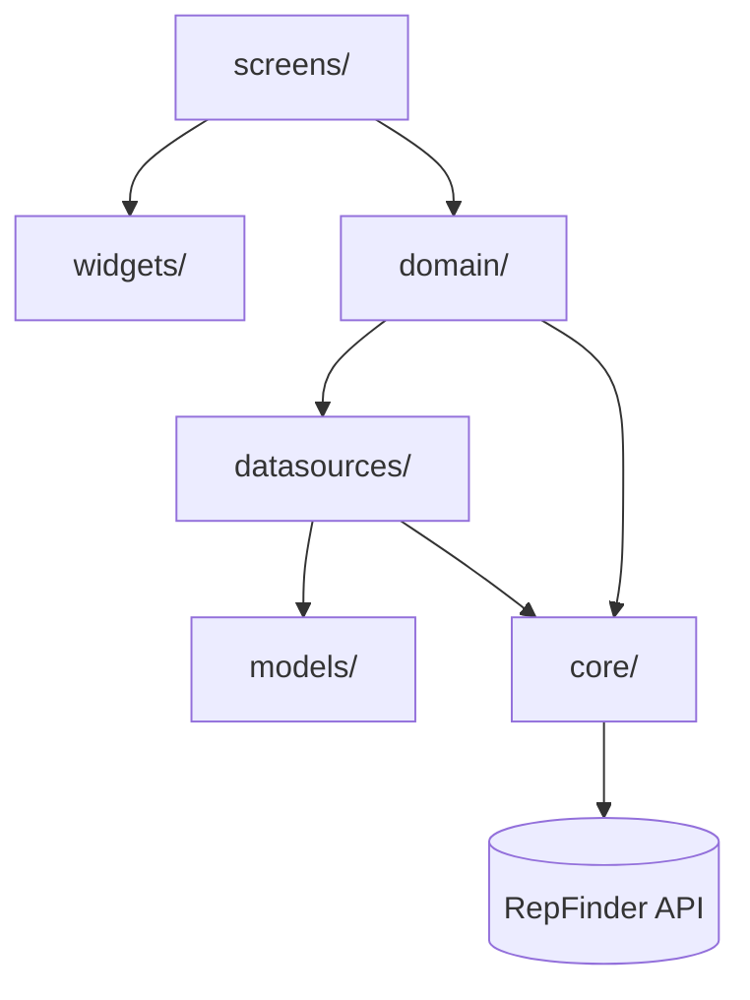

# Arquitetura — App Mobile (Estudante)

## Visão geral

O app é organizado em 6 pacotes dentro de `lib/`, com dependências fluindo em uma única direção: telas consomem widgets e domínio, domínio consome datasources e core, datasources consomem core e models.

Não há ciclos: nenhum pacote importa de volta um pacote que depende dele. Essa regra é o que mantém o projeto fácil de navegar conforme cresce.

---

## Por que essa divisão e não Clean Architecture completa

Clean Architecture tradicional separa `domain` (entidades + casos de uso puros, sem Flutter) de `data` (repositories + datasources) e `presentation` (UI). Para um app deste tamanho — quatro telas, três entidades principais, um único perfil de usuário por app — essa separação adiciona camadas de indireção sem benefício correspondente: cada operação simples (buscar vagas, por exemplo) exigiria um usecase, uma interface de repository, uma implementação e um datasource, quando uma chamada HTTP direta já resolve.

A divisão adotada mantém a ideia central de Clean Architecture — **a UI não conhece detalhes de rede, e a lógica de negócio não conhece widgets** — com menos arquivos por feature. Cada pasta tem uma responsabilidade única e o caminho de uma requisição é sempre o mesmo: Screen → Controller → Datasource → API.

---

## Pacotes

### `core/`

Infraestrutura compartilhada por toda a aplicação, sem dependência de nenhuma feature específica.

- **`http.dart`** — instância única de `Dio` via `dioProvider`, com dois interceptors: cache (`dio_cache_interceptor`) e autenticação. O `AuthInterceptor` injeta o Bearer token em toda requisição e trata erros de forma centralizada — um 401 limpa o storage e redireciona para login via `navigatorKey`, sem que nenhuma tela precise verificar status code manualmente.

- **`storage.dart`** — wrapper sobre `flutter_secure_storage` para token e dados do usuário logado. Centralizar aqui significa que se a estratégia de persistência mudar (por exemplo, adicionar refresh token), só este arquivo é tocado.

- **`connectivity.dart`** — `StreamProvider<bool>` sobre `connectivity_plus`, com `keepAlive: true` para não ser descartado entre navegações. Controllers escutam esse provider para revalidar dados ao reconectar.

- **`offline_queue.dart`** — fila estática persistida em `SharedPreferences` para a única ação de escrita que precisa funcionar offline: candidatar-se a uma vaga. Implementada como métodos estáticos por simplicidade; o trade-off é que não pode ser mockada facilmente em testes, mas o escopo (uma fila de strings) não justificou injeção via Riverpod.

**Decisão consciente:** sem banco local (SQLite/Hive/Drift). O cache HTTP (`dio_cache_interceptor`) cobre a necessidade de mostrar dados "antigos" quando offline, e a fila cobre a única escrita offline. Um banco local introduziria schema próprio e risco de drift entre o modelo local e o da API — complexidade desproporcional ao ganho.

---

### `models/`

Classes de dados puras com `fromJson`/`toJson`, geradas via `json_serializable`. Um arquivo por entidade (`User`, `Vacancy`, `Application`, `AppNotification`), espelhando exatamente os types TypeScript do backend — incluindo nomes de campo que diferem de convenção, como `readed_at`.

**Decisão consciente:** os models não têm lógica nem métodos de negócio — são apenas estrutura de dados. Qualquer transformação (formatação de data, cor de status) fica nos widgets ou controllers, não no model.

---

### `datasources/`

Uma classe por entidade, cada uma recebendo `Dio` via construtor (injetado pelo Riverpod através do `dioProvider`). Responsabilidade única: fazer a chamada HTTP e desserializar a resposta no model correspondente. Nenhum datasource conhece estado de UI ou regras de negócio.

**Caso especial — `notification_datasource.dart`:** usa o pacote `http` em vez de `Dio` para a conexão SSE (`GET /notifications/events`), porque o `Dio` não tem suporte nativo a streams `text/event-stream`. O token é lido diretamente do `SecureStorage` dentro do datasource para montar o header `Authorization` da conexão de streaming, já que o `AuthInterceptor` do Dio não se aplica a essa chamada.

---

### `domain/`

Controllers Riverpod (`@Riverpod(keepAlive: true)`) — um por entidade. Cada controller expõe `AsyncValue<T>` para a UI consumir via `.when()`, e métodos de ação (`login`, `apply`, `markRead`, etc.) que chamam o datasource e atualizam o estado.

`keepAlive: true` em todos os controllers principais é intencional: o estado (lista de vagas, candidaturas, notificações, usuário logado) deve persistir entre navegações dentro da sessão, evitando recarregar a cada troca de tela.

**Caso especial — `application_controller.dart`:** é o único controller que importa `core/http.dart` diretamente (via `dioProvider`), além do seu datasource. Isso ocorre porque o `OfflineQueue.flush()` precisa de uma instância de `Dio` para executar as requisições pendentes quando a conectividade volta, e não há um datasource dedicado à fila. É uma exceção pontual à regra "controller não conhece HTTP diretamente", aceita porque introduzir um datasource só para a fila seria uma camada vazia.

---

### `screens/` e `widgets/`

Screens são `ConsumerWidget`/`ConsumerStatefulWidget` que leem controllers via `ref.watch` e renderizam a UI. Não fazem chamadas HTTP, não acessam `SecureStorage`, não montam URLs — qualquer lógica que não seja puramente de apresentação pertence ao controller.

Widgets (`VacancyCard`, `ApplicationStatusChip`, `NotificationItem`) são componentes de apresentação reutilizáveis, sem estado próprio além do necessário para a UI (ex: animações). Recebem dados já prontos via construtor.

**Ponto de atenção — `VacanciesScreen`:** é a tela com maior número de dependências de domínio, consumindo `vacancyController`, `applicationController` (para saber se o usuário já se candidatou a cada vaga) e `notificationController` (para o badge de não lidas no ícone de sino). Esse acoplamento é inerente ao papel da tela como hub principal do app — não foi extraído um controller agregador porque isso adicionaria uma camada só para compor três `AsyncValue` já simples de combinar na própria tela.

---

## Navegação

`main.dart` define rotas nomeadas e concentra três responsabilidades:

- **`RepFinderApp`** — tema e tabela de rotas
- **`AuthGate`** — lê `authControllerProvider` e redireciona para `/login` ou `/vacancies` conforme o usuário estar autenticado
- **`MainShell`** — bottom navigation com `VacanciesScreen` e `ProfileScreen`; `NotificationsScreen` é acessada como rota separada, fora do shell, via `navigatorKey`

**Decisão consciente:** sem pacote de roteamento declarativo (`go_router`, `auto_route`). Com cinco rotas e um único fluxo de autenticação, o `Navigator` + rotas nomeadas do Flutter é suficiente e evita uma dependência adicional cujo valor só aparece em apps com deep linking ou rotas aninhadas complexas.

---

## Stack de dependências e justificativa

| Pacote | Função | Por que esta escolha |
|---|---|---|
| `dio` + `dio_cache_interceptor` | HTTP + cache | Interceptors nativos cobrem auth e cache sem código repetido por datasource |
| `flutter_riverpod` + `riverpod_annotation` | Estado | `AsyncValue` modela loading/erro/dado sem boilerplate manual; `keepAlive` resolve persistência de estado em sessão sem store separada |
| `flutter_secure_storage` | Token e dados sensíveis | Criptografia nativa da plataforma (Keychain/EncryptedSharedPreferences) |
| `shared_preferences` | Fila offline | Persistência simples para dados não sensíveis |
| `connectivity_plus` | Detecção de rede | Necessário para a estratégia de cache + fila offline |
| `http` | Stream SSE | Único pacote usado que suporta `text/event-stream` nativamente |

---

## O que foi deliberadamente deixado de fora

- **Banco local / ORM** — risco de drift entre schema local e remoto não compensado pelo ganho, dado que o cache HTTP já resolve o caso de uso real
- **Repository pattern formal** — datasources já são o ponto único de acesso a dados; uma camada de repository por cima seria um passthrough
- **Roteador declarativo** — cinco rotas não justificam a dependência
- **Testes de integração para SSE** — cobertos via smoke tests em Fish no backend; testar a reconexão SSE no app exigiria mocks de stream complexos para um ganho marginal neste estágio
